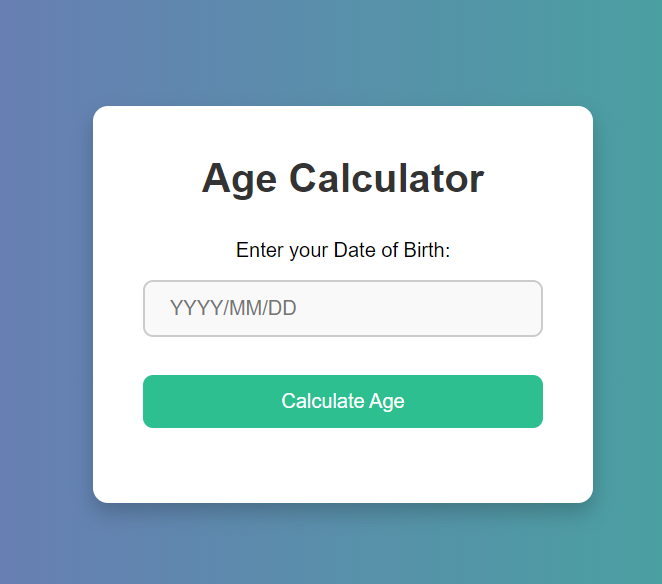

# Age Calculator Project

This project is a simple age calculator built with **JavaScript**, **HTML**, and **CSS**. It allows users to enter their date of birth and calculates their exact age in years, months, and days.

## Table of Contents
- [ScreenShot](#screenshot)
- [Features](#features)
- [Built With](#built-with)
- [Prerequisites](#prerequisites)
- [Usage](#usage)
- [Contact](#contact)

## ScreenShot



<p align="right">(<a href="#table-of-contents">back to top</a>)</p>

## Features

- Simple and user-friendly interface.
- Input date of birth using a modern date picker.
- Calculates age in years, months, and days.
- Displays results instantly upon clicking the "Calculate Age" button.
- Responsive design using CSS.

<p align="right">(<a href="#table-of-contents">back to top</a>)</p>

## Built With

This project was built using only the following technologies:

* 
* 
* 

<p align="right">(<a href="#table-of-contents">back to top</a>)</p>

## Prerequisites

To run this project, all you need is a modern web browser that supports HTML, CSS, and JavaScript. There are no additional libraries or dependencies required.

<p align="right">(<a href="#table-of-contents">back to top</a>)</p>

## Usage

1. Clone the project from GitHub or download the files:
   ```bash
   git clone https://github.com/AmirrezaAhmadi/AgeCalculator-App.git

2. Open the AgeCalculator.html file in your browser.

<p align="right">(<a href="#table-of-contents">back to top</a>)</p>

## Contact

You can reach me through the following:

* Email: AmirrezaAhmadi.GH@Gmail.com
* Telegram: https://t.me/AmirrezaDevelop
* Instagram: https://www.instagram.com/codewithamirreza
* Project Link: https://github.com/AmirrezaAhmadi/AgeCalculator-App.git

<p align="right">(<a href="#table-of-contents">back to top</a>)</p>